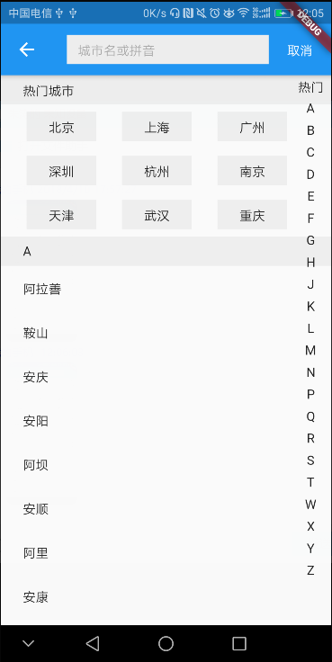

# china_city_selector

 中国城市选择器
  搜索/按字母选择

## Getting Started

  1.可添加/修改[热门城市]数据（./china_cities.dart/china_cities_hot_data）；
  2.不使用[热门城市]将数据（./china_cities.dart/china_cities_data）
  注释掉:{"name": "热门", "pinyin": "0"},
  3.点击回掉方法在_onTileClick
  4.暂时没有定位功能
  
  数据在：china_cities.dart
  文字描述在：strings.dart

 app:https://fir.im/selector

 